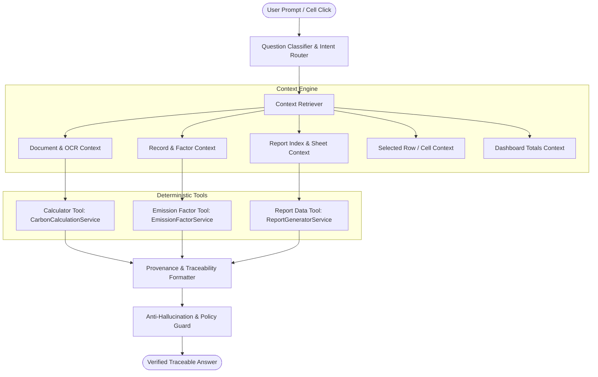

# CarbonLedger OS — AI Data Assistant & Report Copilot Documentation

**Version:** 7.1 Enterprise Production  
**Component:** Context-Aware AI Data & Report Copilot  
**Repository:** `Carbonledger`  
**Production URL:** https://carbonledger-app-vxb3.onrender.com/

---

## 1. AI Architecture Overview

The **CarbonLedger AI Copilot** is a deterministic, context-grounded sustainability copilot embedded within CarbonLedger Enterprise OS. Unlike generic Large Language Model chatbots, the Copilot executes against verified workspace data, active emission factor databases, and calculation engines without fabricating information.



---

## 2. Question Library Summary

The AI Copilot is validated against 14 analytical categories in [`CARBONLEDGER_AI_QUESTION_LIBRARY.md`](./CARBONLEDGER_AI_QUESTION_LIBRARY.md):

| Category | Domain | Core Questions Answered |
|---|---|---|
| **A** | **Document Understanding** | Extracted line items, detected document types, OCR confidence scores, page references. |
| **B** | **Material Carbon Emissions** | Material footprint, activity quantities, factor lookups, step-by-step calculation proofs. |
| **C** | **Fuel and Scope 1** | Direct stationary combustion, mobile fleet fuels, diesel volume conversions. |
| **D** | **Electricity and Scope 2** | Location-based vs. market-based grid factors, regional compatibility, zero silent substitution. |
| **E** | **Transportation & Logistics** | Freight cargo weight, distance, tonne-km formula, Scope 3 Cat 4 freight. |
| **F** | **Unit Conversion** | Mass ($\text{kg} \leftrightarrow \text{t}$), Energy ($\text{kWh} \leftrightarrow \text{MWh}$), Volume-to-density conversions. |
| **G** | **Emission Factors** | Provenance databases (DEFRA, EPA, Ecoinvent, CBAM), versioning, geography. |
| **H** | **Scope Classification** | Boundary rationale distinguishing factual data from methodological interpretations. |
| **I** | **Validation and Review** | Anomaly outliers, missing mandatory fields, low match confidence, duplicate flags. |
| **J** | **Calculation Explanation** | $Activity \times Unit\ Conversion \times Factor = CO_2e$. |
| **K** | **Dashboard Questions** | Total inventory footprint, Scope breakdowns, top emitting suppliers and materials. |
| **L** | **Report Questions** | Multi-sheet structure (all 11 sheets), column definitions, CBAM declarations. |
| **M** | **Report-Specific Context** | "What is this?", "Why is this number here?", cell and row inspector. |
| **N** | **Troubleshooting** | OCR parsing failures, unmapped materials, zero-emission diagnoses. |

---

## 3. Available AI Context Hierarchy

The Copilot dynamically assembles context across 7 levels:

```
Tenant & Workspace Identity
   └── Upload Session (Filename, Pages, Confidence)
        ├── Extracted Line Items (Raw OCR tokens)
        ├── Approved Calculation Results (Factor ID, Formula, CO2e)
        ├── Compliance Reports (report_context.json)
        │    ├── Active Sheet (Executive Summary, Scope 1/2/3, CBAM, Audit Trail)
        │    └── Focused Row & Cell (Selected coordinate, Metric, PO)
        └── Session Conversation Memory (Multi-turn follow-up history)
```

---

## 4. Document Context

When a user uploads a document (PDF, Excel, JSON), the following context is parsed and made available:
- `document_id` & `upload_id`: Unique cryptographic session tokens.
- `filename`: Original document name.
- `document_type`: Classified invoice, purchase order, bill of lading, or utility bill.
- `pages_count`: Number of processed pages.
- `ocr_confidence_pct`: Optical character recognition confidence.
- `extracted_records`: Raw tokens, bounding boxes, and detected tables.

---

## 5. Calculation Context

Every calculated line item contains full mathematical provenance:
- `record_id`: Database primary key.
- `po_number`: Extracted purchase order or invoice identifier.
- `material`: Original raw material string and normalized matched alias.
- `quantity` & `unit`: Activity volume.
- `normalized_quantity` & `factor_unit`: Normalized denominator for factor product.
- `emission_factor`: Numerical coefficient.
- `co2e_kg`: Carbon dioxide equivalent footprint ($1\text{ t} = 1,000\text{ kg}$).
- `formula`: Exact arithmetic string (e.g. `0.50 tonne * 1890.00 kgCO2e/t = 945.00 kgCO2e`).
- `trace_json`: 5-step lifecycle trace log.

---

## 6. Emission Factor Context

Emission factors are sourced from the centralized `EmissionFactorService` (singleton loaded from `master_factors_cleaned.csv` containing 8,740+ factors):
- `factor_id`: Unique identifier (e.g., `DEFRA_STEEL_2026`).
- `factor_source`: Dataset authority (DEFRA, EPA GHG Hub, Ecoinvent 3.10, EU CBAM Defaults).
- `factor_version`: Release version / year (2026).
- `region`: Geographic applicability (DE, EU-27, US, Global RoW).
- `confidence`: Semantic matching confidence score ($\ge 95\%$ for automated pass).

---

## 7. Dashboard Context

On the Dashboard tab, the Copilot aggregates:
- `total_co2e_kg` & `total_co2e_tonnes`: Organization-wide carbon inventory.
- `scope_1_kg`, `scope_2_kg`, `scope_3_kg`: Protocol breakdown percentages.
- `top_suppliers`: Ranked list of vendor entities by emissions.
- `top_materials`: Ranked list of procured commodities by carbon intensity.
- `cbam_cost_eur`: Total carbon tariff liability at $€85/\text{tonne}$.

---

## 8. Report Context

Generated reports produce a machine-readable index `report_context.json` alongside `.xlsx`, `.pdf`, and `.json` artifacts:
- `report_id`: Unique report identifier (e.g. `RPT-upload_8a9f-4B219E81`).
- `sheets`: Structured index of all 11 sheets.
- `summary`: High-level metrics mirror.
- `total_records_count`: Number of underlying transactions.

---

## 9. Sheet Context

The Copilot recognizes the active sheet opened in the Report Explorer:
1. `Executive Summary`: High-level executive ESG metrics and pass rates.
2. `Document Summary`: Intake metadata and extraction accuracy.
3. `Materials`: Commodity volume and intensity tables.
4. `Emission Summary`: Scope 1, 2, and 3 distribution.
5. `Scope 1`: Direct stationary and mobile combustion.
6. `Scope 2`: Location-based grid electricity.
7. `Scope 3`: Supply chain goods (Cat 1) and freight transport (Cat 4).
8. `CBAM Cost`: Certificate price calculations ($€85/\text{t}$).
9. `Top Emitters`: Supplier and material rankings.
10. `Recommendations`: Strategic reduction pathways.
11. `Audit Trail`: Immutable timestamped logs with SHA-256 verification.

---

## 10. Selected Row & Cell Context

When an auditor clicks a cell or row in the **Report Explorer** or **Review Table**, the Copilot receives:
```json
{
  "page": "Reports",
  "sheet_name": "Scope 3",
  "selected_cell": {
    "column": "co2e_kg",
    "value": 945.0,
    "row_data": {
      "po_number": "PO-9001",
      "material": "Hot Rolled Steel",
      "supplier": "SteelCorp Global",
      "quantity": 500.0,
      "unit": "kg",
      "emission_factor": 1.89,
      "factor_id": "DEFRA_STEEL_2026",
      "formula": "0.50 tonne * 1890.00 kgCO2e/t = 945.00 kgCO2e"
    }
  }
}
```
The Copilot traces the exact cell value back to its line item origin.

---

## 11. Retrieval Architecture

Context is selectively queried using indexed SQLite tables and session caches rather than dumping entire databases into LLM context windows:
1. Tenant token authentication resolves `user_id` and active `upload_id`.
2. Question classifier identifies required context scope (Record, Document, Factor, Report).
3. Retrieval queries filter by `user_id = ? AND upload_id = ?`.
4. Only relevant rows/metrics are passed to the answer synthesizer.

---

## 12. Deterministic Calculation Tools

The Copilot uses `CarbonCalculationService` for arithmetic:
- Mass conversion: $Q_{\text{t}} = Q_{\text{kg}} \div 1000$.
- Electricity conversion: $Q_{\text{MWh}} = Q_{\text{kWh}} \div 1000$.
- Transport intensity: $T = Mass_{\text{t}} \times Distance_{\text{km}} \times Factor$.
- Footprint product: $CO_2e = Q_{\text{normalized}} \times Factor$.

Mental LLM arithmetic approximations are strictly forbidden.

---

## 13. Report Data Tools

The Copilot uses `ReportGeneratorService.get_report_context()` to inspect generated report schemas, column types, row counts, and formula strings.

---

## 14. Security & Multi-Tenant Isolation

- All endpoints enforce JWT bearer authentication or session user tokens.
- SQL queries bind parameterized `WHERE user_id = ?`.
- User A cannot query or view documents, factors, or reports belonging to User B.
- Role-Based Access Control (RBAC) verifies permissions for downloads and audit logs.

---

## 15. Strict Anti-Hallucination Guardrails

- **Zero-Guessing Rule**: If an emission factor does not exist in the verified database, the Copilot explicitly states:
  > *"CarbonLedger does not currently have a verified emission factor for '[Material]' in the loaded emission factor library. I cannot calculate or guess a CO2e value without an approved factor."*
- **No Fabricated Documents/Baselines**: Asking for years with no data (e.g., 2018) returns an explicit "Historical data unavailable" response.
- **Explicit Known vs. Inferred**: Verbatim document fields are distinguished from normalized values.

---

## 16. Dynamic Suggested Questions System

The Copilot returns page-specific suggested question pills:
- **Intake**: *"What carbon data was extracted?", "Which materials were found?", "What does the OCR confidence score mean?"*
- **Review**: *"Why is this record marked Review Required?", "Which factor will be assigned to steel?", "Are there duplicate records?"*
- **Dashboard**: *"What is my total footprint?", "Which supplier has highest emissions?", "Explain Scope 1/2/3."*
- **Reports**: *"Explain this sheet", "Where did this number come from?", "How is CBAM cost calculated?"*

---

## 17. Test Suite Validation

Automated tests in [`tests/test_ai_copilot.py`](file:///c:/Users/Aniket%20Singh/OneDrive/Documents/GitHub/Carbonledger/tests/test_ai_copilot.py) validate:
1. Document understanding
2. Deterministic material carbon calculations
3. Emission factor provenance
4. Scope 1 fuel breakdowns
5. Scope 2 electricity grid calculations
6. Transport logistics (tonne-km)
7. Mathematical unit conversions
8. Scope classification boundaries
9. Validation & review flags
10. Calculation formulas
11. Dashboard totals
12. Top supplier rankings
13. Report multi-sheet indexing
14. Sheet-specific inquiries
15. Selected cell inspection
16. Simple language mode
17. Multi-turn follow-up queries
18. Anti-hallucination unknown material checks
19. Anti-hallucination historical year checks
20. Dynamic suggestions generation

---

## 18. Example Copilot Conversations

### Example 1: Material Calculation with Factor Provenance
> **User:** "How much CO2e does 500 kg of steel produce?"  
> **Copilot:**  
> ### Calculation & Data Provenance: Steel
> - **Material**: Steel Sheet (Hot Rolled)
> - **Activity Quantity**: 500.00 kg (0.50 metric tonnes)
> - **Matched Emission Factor**: 1.8900 kg CO₂e/kg (ID: `DEFRA_STEEL_2026`)
> - **Factor Source**: DEFRA GHG Conversion Factors 2026
> - **Calculation Formula**: `500.0 kg × 1.89 kg CO₂e/kg = 945.00 kg CO₂e`
> - **Result**: **945.00 kg CO₂e** (0.945 tonnes CO₂e)
> - **Audit Verification**: Deterministic Engine Verified (Zero Approximation)

### Example 2: Multi-turn Follow-up
> **User:** "What if it was 2 tonnes?"  
> **Copilot:**  
> ### Calculation & Data Provenance: Steel
> - **Material**: Steel Sheet (Hot Rolled)
> - **Activity Quantity**: 2.00 metric tonnes (2,000.00 kg)
> - **Matched Emission Factor**: 1.8900 kg CO₂e/kg
> - **Calculation Formula**: `2000.0 kg × 1.89 kg CO₂e/kg = 3,780.00 kg CO₂e`
> - **Result**: **3,780.00 kg CO₂e** (3.780 tonnes CO₂e)

### Example 3: Anti-Hallucination for Unknown Material
> **User:** "What is the carbon emission of 500 kg of Vibranium?"  
> **Copilot:**  
> I can confirm the requested activity is **500.0 kg of 'Vibranium'**. However, CarbonLedger does not currently have a verified emission factor for **'Vibranium'** in the loaded emission factor library (DEFRA/EPA/Ecoinvent).  
> **Zero-Hallucination Policy:** I cannot guess or fabricate a CO₂e value without an approved factor. Please add a custom factor in Admin Console or assign a supplier-specific factor in Review.
