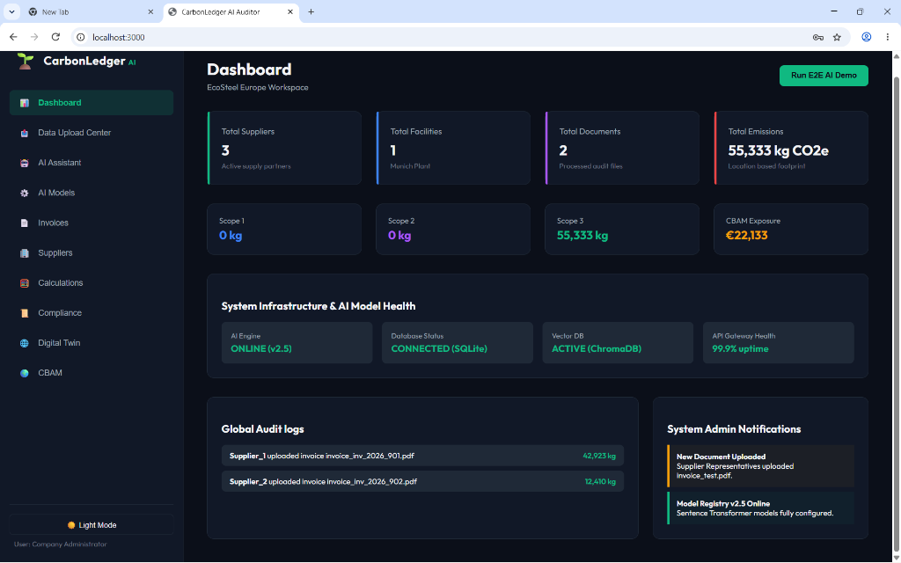
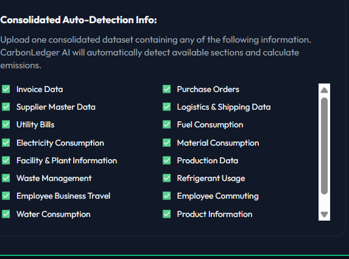
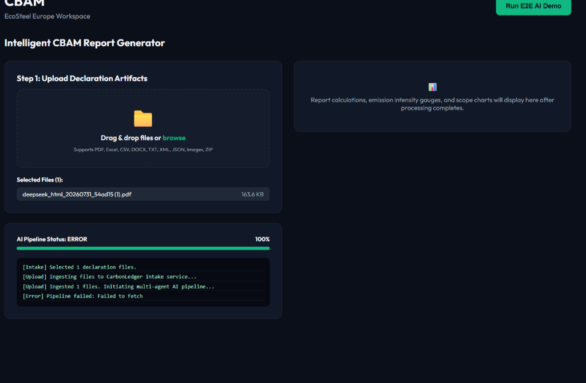
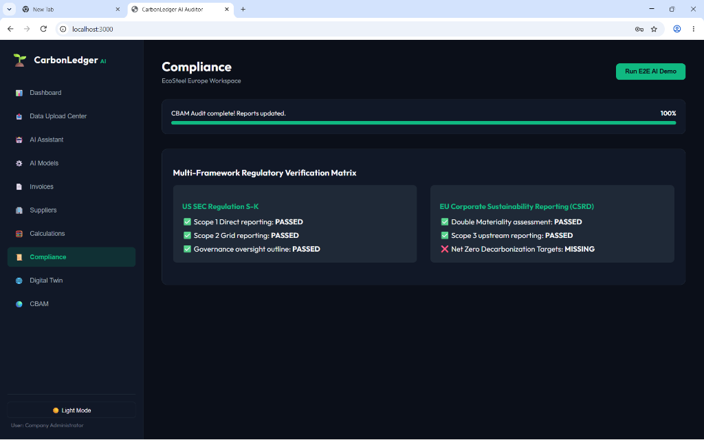
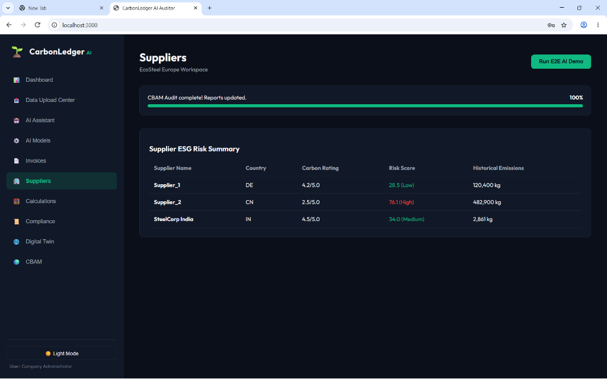
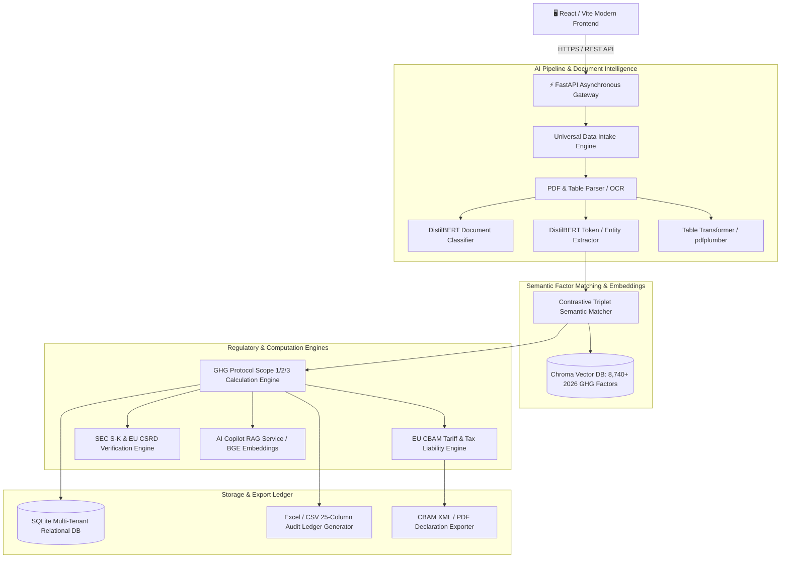

# CarbonLedger Enterprise Sustainability & CBAM Compliance OS

<div align="center">

[](https://carbonledger-app-vxb3.onrender.com)
[](https://carbonledger-api-8bl2.onrender.com/docs)
[](LICENSE)
[](https://www.python.org/)
[](https://vitejs.dev/)
[](https://www.trychroma.com/)

**Enterprise-grade Sustainability Operating System for Supply Chain Carbon Auditing, Multi-Stream Data Extraction, and EU CBAM / US SEC / EU CSRD Regulatory Compliance.**

[🌐 Live Web Application](https://carbonledger-app-vxb3.onrender.com) • [📖 Interactive API Docs](https://carbonledger-api-8bl2.onrender.com/docs) • [📊 Technical Audit Report](docs/CARBONLEDGER_TECHNICAL_AUDIT_REPORT.md) • [📋 System Requirements (SRS)](docs/CarbonLedger_SRS_v1.0.pdf)

</div>

---

## 🌟 Overview

**CarbonLedger** is an enterprise sustainability operating system built to automate, simulate, and audit supply chain carbon emissions ($Scope\ 1,\ Scope\ 2,\ Scope\ 3$) and calculate cross-border **EU CBAM (Carbon Border Adjustment Mechanism)** tax liabilities.

By pairing modern document intelligence (LayoutLMv3, DistilBERT, Table Transformer, and OCR) with high-dimensional vector search across **8,740+ authoritative 2026 GHG Emission Factors**, CarbonLedger eliminates manual ESG data entry, enforces zero-baseline data governance, and generates verifiable, audit-grade carbon ledgers.

---

## 🚀 Live Demo & Production Endpoints

| Resource | URL | Description |
| :--- | :--- | :--- |
| **🌐 Production Web App** | [carbonledger-app-vxb3.onrender.com](https://carbonledger-app-vxb3.onrender.com) | Interactive React / Vite Enterprise Dashboard |
| **⚡ Backend API (FastAPI)** | [carbonledger-api-8bl2.onrender.com](https://carbonledger-api-8bl2.onrender.com) | Core API Service & Asynchronous Processing Engine |
| **📑 Swagger API Documentation** | [carbonledger-api-8bl2.onrender.com/docs](https://carbonledger-api-8bl2.onrender.com/docs) | Interactive OpenAPI / Swagger UI |
| **📚 ReDoc Specification** | [carbonledger-api-8bl2.onrender.com/redoc](https://carbonledger-api-8bl2.onrender.com/redoc) | Alternative structured technical API reference |

> **Demo Credentials (Pre-seeded):**  
> **Email:** `admin@carbonledger.io` | **Password:** `Admin@12345`  
> *(Or click the one-click **"Run E2E AI Demo"** button on the live app)*

---

## 📸 Platform Interface Showcase

### 1. Executive Sustainability Dashboard
*Real-time executive oversight displaying Scope 1, 2, and 3 emissions partitioning, CBAM financial exposure (€), AI model & infrastructure health status, and live immutable audit logs.*


---

### 2. Multi-Stream Consolidated Auto-Detection
*Universal multi-modal data ingestion pipeline supporting 14+ distinct enterprise operational and ESG data streams with automatic schema and entity resolution.*


---

### 3. Intelligent CBAM Report Generator & AI Pipeline
*Automated EU CBAM quarterly declaration compilation, customs tariff classification, direct/indirect embedded emissions calculation, and real-time pipeline status telemetry.*


---

### 4. Multi-Framework Regulatory Verification Matrix
*Continuous compliance engine validating corporate emissions declarations against US SEC Regulation S-K and EU Corporate Sustainability Reporting Directive (CSRD) double materiality.*


---

### 5. Supplier ESG Risk Matrix & Decarbonization Scoring
*Supply chain risk scoring, historical emission benchmarking, ESG rating evaluation ($1.0 - 5.0$), and automated supplier decarbonization recommendations.*


---

## 🏛️ System Architecture



---

## ⚡ Core Features & Capabilities

- **Universal Multi-Stream Ingestion**: Ingests Invoices, Purchase Orders, Utility Bills, Fuel Logs, Logistics Manifests, Waste, and Water datasets in PDF, Excel, CSV, DOCX, JSON, or Image formats.
- **Zero-Baseline Data Governance**: Enforces zero-baseline data integrity—no hallucinated or unapproved placeholder emissions ever reach corporate ESG reports without human-in-the-loop review.
- **Semantic GHG Factor Matching**: High-dimensional contrastive semantic retrieval matching raw item descriptions against the 2026 GHG Emission Factor master dataset (8,740+ factors).
- **Automated CBAM Tax Calculation**: Automatically calculates direct and indirect embedded emissions, country-specific grid emission adjustments, and estimated EU ETS carbon tariff liabilities.
- **25-Column Audit-Grade Export**: Produces verifiable CSV and Excel workbooks linking every kilogram of $\text{CO}_2\text{e}$ back to raw invoices, bounding-box provenance, and factor reference codes.
- **Interactive AI Copilot (RAG)**: Natural-language assistant backed by dense embeddings to answer complex queries about high-emission suppliers, scope partitions, and mitigation pathways.

---

## 🤖 AI Models & Pipelines

1. **Document Classifier**: Sequence classification model fine-tuned on `distilbert-base-uncased` across procurement and ESG document types.
2. **NER Extractor**: Fine-tuned token classifier extracting material names, quantities, unit conventions, supplier identifiers, and origins.
3. **Contrastive Semantic Matcher**: Fine-tuned SentenceTransformer leveraging triplet loss for robust fuzzy matching between colloquial invoice descriptions and official GHG factor taxonomies.
4. **Supplier Anomaly & Risk Scorer**: Isolation Forest and Random Forest classifiers predicting supplier carbon risk ratings and anomalous emission spikes.

---

## 📂 Repository Structure

```
Carbonledger/
├── api/                  # FastAPI Application, routes, schemas, and SQLite database models
├── assets/               # Visual assets and application UI screenshots
│   └── screenshots/      # High-resolution dashboard and workflow captures
├── configs/              # Deployment configurations and logging profiles
├── datasets/             # Master datasets, GHG factor workbooks, and transactional generators
│   ├── compressed/       # Compressed archives of simulated enterprise ERP data
│   └── CarbonLedger_GHG_Factors_2026_Clean.xlsx
├── docker/               # Multi-container Dockerfile and docker-compose configurations
├── docs/                 # System documentation, specifications, and presentation scripts
│   ├── CARBONLEDGER_COMPLETE_WALKTHROUGH.md
│   ├── CARBONLEDGER_DEMO_SCRIPT.md
│   ├── CARBONLEDGER_TECHNICAL_AUDIT_REPORT.md
│   └── CarbonLedger_SRS_v1.0.pdf
├── frontend/             # Vite + React single-page enterprise web application
├── models/               # Fine-tuned model definitions, loaders, and pretrained caches
├── pipeline/             # Multi-stage asynchronous extraction and reconciliation pipelines
├── scripts/              # Setup orchestrators, database seeders, and validation scripts
├── services/             # Core computation, CBAM, RAG Copilot, and table detection engines
├── tests/                # Pytest suites, end-to-end integration tests, and sample fixtures
├── render.yaml           # Automated Cloud Deployment Blueprint for Render
├── requirements.txt      # Python runtime dependencies
└── package.json          # Frontend dependencies configuration
```

---

## 🛠️ Local Installation & Setup

### Prerequisites
- **Python 3.10+**
- **Node.js 18+** & **npm**
- **Git LFS** (Git Large File Storage)

### 1. Clone the Repository & Pull LFS Assets
```bash
# Initialize Git LFS
git lfs install

# Clone repository
git clone https://github.com/kayastha12/Carbonledger.git
cd Carbonledger

# Pull fine-tuned models and datasets
git lfs pull
```

### 2. Install Backend & Frontend Dependencies
```bash
# Install Python backend dependencies
pip install -r requirements.txt

# Install React frontend dependencies
cd frontend
npm install
cd ..
```

### 3. One-Click Automated Environment Setup
Run the master setup script to extract datasets, pre-download pretrained Hugging Face weights, and build the ChromaDB vector index:
```bash
python scripts/setup_project.py
```

### 4. Initialize SQLite Database
Initialize database tables and seed with multi-tenant default roles, users, and supplier records:
```bash
python api/database.py
```

---

## 💻 Running the Application Locally

### Start Backend API Server (FastAPI)
```bash
python run_server.py
```
*API will be available at:* **`http://localhost:8000`**  
*Interactive Swagger documentation:* **`http://localhost:8000/docs`**

### Start Frontend Development Server (React / Vite)
```bash
cd frontend
npm run dev
```
*Frontend will be available at:* **`http://localhost:3000`** (or `http://localhost:5173`)

---

## 🧪 Testing & Verification

Execute the complete automated test suite covering document classification, factor matching, and mathematical calculation parity:

```bash
# Run all automated unit and integration tests
pytest

# Run end-to-end master reconciliation audit
python verify_master_e2e_reconciliation.py

# Benchmark local pipeline performance
python benchmark_local_e2e.py
```

---

## 📖 Key Documentation & Resources

- 📊 **[Technical Audit & Verification Report](docs/CARBONLEDGER_TECHNICAL_AUDIT_REPORT.md)**: Exhaustive verification metrics, model accuracy benchmarks, and data flow audits.
- 📋 **[System Requirements Specification (SRS)](docs/CarbonLedger_SRS_v1.0.pdf)**: Formal software architecture, compliance requirements, and data models.
- 🎙️ **[Live Demo & Presentation Script](docs/CARBONLEDGER_DEMO_SCRIPT.md)**: Step-by-step presentation script for live client and investor walkthroughs.
- 📘 **[Complete System Walkthrough](docs/CARBONLEDGER_COMPLETE_WALKTHROUGH.md)**: Deep dive into the backend engines, math formulations, and endpoints.
- 🤖 **[AI Copilot Documentation](CARBONLEDGER_AI_COPILOT_DOCUMENTATION.md)**: Architectural guide to RAG integration and vector retrieval.
- 📑 **[Document Intake & Approval Workflow](DOCUMENT_INTAKE_APPROVAL_WORKFLOW_REPORT.md)**: Detailed audit report of human-in-the-loop validation stages.

---

## 📄 License

This project is licensed under the MIT License - see the [LICENSE](LICENSE) file for details.

---

## 👥 Authors & Acknowledgments

- **Lead Software Architect & AI Engineering**: Aniket Singh
- **CarbonLedger Team**: Enterprise Sustainability & Regulatory Engineering

<div align="center">
<sub>Built with precision for institutional decarbonization and global emissions transparency.</sub>
</div>
