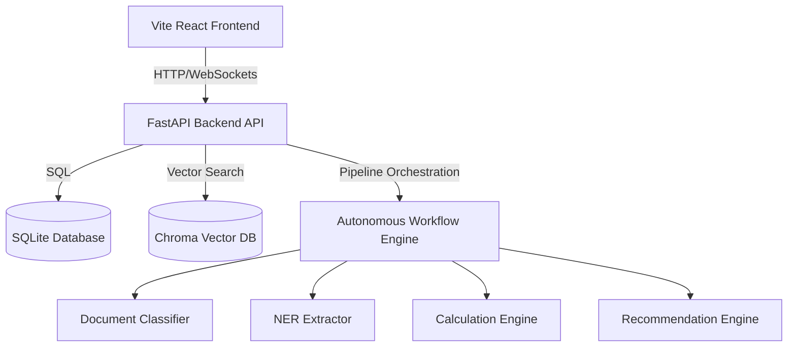

# CarbonLedger Enterprise Sustainability OS

CarbonLedger is an enterprise-grade sustainability operating system designed to simulate, monitor, and audit supply chain carbon emissions and CBAM (Carbon Border Adjustment Mechanism) tax compliance. The platform integrates machine learning classification, Named Entity Recognition (NER), semantic matching, and analytical reporting to automate emissions auditing.

---

## Architecture Overview

CarbonLedger uses a decoupled architecture with a FastAPI backend and a Vite React frontend:



---

## Features

- **Document Processing**: Automatic document classification (Invoices, Utility Bills, POs, etc.) and NER information extraction.
- **Emissions Auditing & Calculations**: Automated Scope 1, 2, and 3 emission calculations using standardized activity factors.
- **Dynamic Factor Matching**: Contrastive learning semantic search of raw descriptions against 2026 GHG Emission Factors using ChromaDB.
- **SaaS Governance & Auditing**: Complete RBAC (Role-Based Access Control) multi-tenant framework with audit trail logs and automated alerting.
- **CBAM Compliance Reporting**: Automatic generation of CBAM quarterly declarations and PDF/Excel exports.
- **Predictive Analytics & Digital Twins**: LSTM-based facility forecasting and supply chain simulation.

---

## AI Models & ML Pipelines

1. **Document Classifier**: Fine-tuned sequence classifier based on `distilbert-base-uncased` mapping text to document categories.
2. **NER Extractor**: Fine-tuned token classifier based on `distilbert-base-uncased` extracting critical transactional metadata (supplier, material, quantity, units, country, etc.).
3. **Contrastive Matcher**: SentenceTransformer model fine-tuned using contrastive triplet loss to map arbitrary invoice descriptions to standardized GHG factors.
4. **Supplier Risk & Recommenders**: Random Forest and Isolation Forest classifiers for supplier ESG ratings, anomaly verification, and reduction recommendations.

---

## Datasets

All raw master datasets, transactional simulated ERP logs, and emission factor tables are stored under [datasets/](file:///d:/internship/carbonledger/datasets/):
- **Master Lists**: `datasets/output/master/` (Companies, Suppliers, Products, Plants)
- **Simulated Transactions**: `datasets/output/transactional/` (Invoices, POs, Logistics, Utility Bills, ESG Audits, RAG Documents)
- **GHG Factors Workbook**: `datasets/CarbonLedger_GHG_Factors_2026_Clean.xlsx`

---

## Installation & Setup

### Prerequisites
- Python 3.10+
- Node.js 18+
- Git LFS (Git Large File Storage)

### 1. Set Up Git LFS & Clone
Initialize Git LFS on your machine to pull the fine-tuned model files during cloning:
```bash
# Initialize Git LFS on your machine
git lfs install

# Clone the repository
git clone https://github.com/ani-1129/CarbonLedger.git
cd CarbonLedger

# Verify large LFS assets are pulled
git lfs pull
```

### 2. Install Dependencies
```bash
# Install Python backend dependencies
pip install -r requirements.txt

# Install React frontend dependencies
cd frontend
npm install
cd ..
```

### 3. Automated One-Click Environment Setup
Run the master setup script to decompress datasets, pre-download AI models from Hugging Face, and build the vector database:
```bash
python scripts/setup_project.py
```
This single command automates the following phases:
1. **Decompress Datasets**: Extracts compressed ZIP dataset archives from `datasets/compressed/` into `datasets/output/` (Procurement logs, Invoices, Logistics, Utilities, etc.).
2. **Download AI Models**: Automatically pre-downloads and caches all required pretrained models (DistilBert, LayoutLMv3, Table Transformer, BGE Embeddings, and Qwen2.5-Instruct) into `models/pretrained/`.
3. **Rebuild Vector DB**: Cleans the emission factor workbook and builds the semantic embeddings index inside ChromaDB.

### 4. Initialize SQLite Database
Initialize the relational schema and seed it with multi-tenant default roles, users, and suppliers:
```bash
python api/database.py
```


---

## Running the Application

### Running Backend API
Start the FastAPI server from the workspace root directory:
```bash
python -m api.main
```
The interactive API documentation is available at [http://localhost:8000/docs](http://localhost:8000/docs).

### Running Frontend Development Server
Start the React application from the `frontend/` directory:
```bash
cd frontend
npm run dev
```
Open [http://localhost:3000](http://localhost:3000) in your browser.

---

## Training Models

Orchestrate the full training pipeline (Document Classifier, NER, Recommendation models, Anomaly detector) using the unified training runner:
```bash
python -m training.train_all
```
Alternatively, train specific components using their standalone scripts:
- **Contrastive Matcher**: `python -m training.train_contrastive_matcher`
- **Voter Forecaster**: `python -m training.train_forecaster`

---

## Folder Structure

```
CarbonLedger/
├── api/                  # FastAPI Web Server and database connections
├── backend/              # Production deployment placeholder
├── configs/              # System and deployment configurations
├── datasets/             # Data files, templates, and dataset generators
├── docker/               # Container files (Dockerfiles & compose files)
├── docs/                 # Documentation (SRS, reports, slides)
├── evaluation/           # Performance auditing and benchmarking suites
├── frontend/             # React application (Vite-based dev environment)
├── models/               # Fine-tuned weights, pretrained caching, and model loaders
├── output/               # Active output results and files
├── preprocessing/        # Raw data cleaning and index preparation
├── reports/              # Final static and generated audit reports
├── scripts/              # Validation pipelines and maintenance scripts
├── services/             # Core business engines (Calculations, RAG, Agents)
├── tests/                # Automated pytest files
├── vector_db/            # ChromaDB vector index folders
├── assets/               # Static media files and screenshots
├── LICENSE               # Project license file
├── README.md             # Documentation readme
├── requirements.txt      # Python dependencies
└── package.json          # Node dependencies list (frontend)
```

---

## Key API Endpoints

- `POST /api/v1/documents/upload` - Upload and classify sustainability invoices or manifest files.
- `GET /api/v1/carbon/inventory` - Fetch current corporate GHG inventory.
- `POST /api/cbam/process` - Parse and calculate CBAM tax liability.
- `GET /api/cbam/pdf/{id}` - Export CBAM Declaration report as PDF.
- `GET /api/cbam/excel/{id}` - Export CBAM Declaration report as Excel spreadsheet.
- `GET /api/models/status` - Health check status of AI classifiers and extractors.

---

## Deployment (Docker)

To deploy the production-ready application stack using Docker Compose:
```bash
cd docker
docker-compose up --build -d
```

---

## Troubleshooting

### Git LFS Bandwidth / Limit Errors
If you run into Git LFS transfer limits or bandwidth errors during cloning, you can clone the repository without pulling LFS pointers immediately:
```bash
GIT_LFS_SKIP_SMUDGE=1 git clone https://github.com/ani-1129/CarbonLedger.git
```
Then pull them individually:
```bash
git lfs pull
```

### Missing Pretrained Cache Folders
If you receive a `FileNotFoundError` or `ModuleNotFoundError` during server startup, ensure that the one-click setup orchestrator script has been executed successfully:
```bash
python scripts/setup_project.py
```
This script downloads Hugging Face models and extracts zipped datasets locally, ensuring all local cache assumptions match.

---

## License

This project is licensed under the MIT License - see the [LICENSE](file:///d:/internship/carbonledger/LICENSE) file for details.

---

## Contributors

- **Lead Software Architect & DevOps**: Aniket Singh
- **Sustainability Engineering**: CarbonLedger Team
