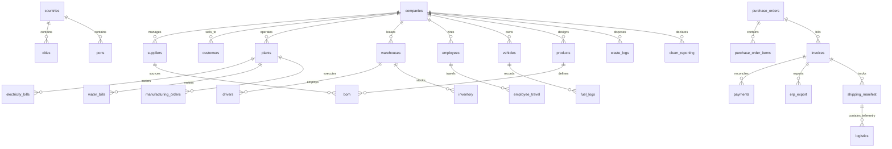

# CarbonLedger Database ER Diagram & Data Dictionary

This document details the complete relational schema of CarbonLedger, showing how master tables link to transactional files.

## Entity Relationship Diagram (ERD)

---

## Data Dictionary (Key Tables)

### 1. `companies`
Master table of companies participating in the supply chain auditing system.
- `CompanyID` (INT, PK): Unique sequential company identifier.
- `CompanyName` (VARCHAR): Registered legal name.
- `Industry` (VARCHAR): e.g. Steel, Aluminium, Chemical.
- `Country` (VARCHAR, FK): Country name references `countries`.
- `GSTNumber` (VARCHAR): Country-specific business tax identification.
- `AnnualRevenue` (DECIMAL): Annual turnover in local currency.
- `Employees` (INT): Total head count.
- `CarbonReportingRequired` (BOOLEAN): ESG compliance indicator.
- `NetZeroTargetYear` (INT): Year targeted for net-zero.

### 2. `suppliers`
Master table of raw material and service suppliers.
- `SupplierID` (INT, PK): Unique supplier ID.
- `CompanyID` (INT, FK): References the client `companies`.
- `SupplierName` (VARCHAR): Registered business name.
- `Country` (VARCHAR): Country name.
- `EmissionScore` (DECIMAL): Standard carbon efficiency score (lower is cleaner).
- `SupplierRating` (DECIMAL): Compliance score (1.0 to 5.0).

### 3. `products`
Master table of manufactured items.
- `ProductID` (INT, PK): Unique product ID.
- `CompanyID` (INT, FK): References the manufacturer `companies`.
- `SKU` (VARCHAR): Unique stock keeping unit.
- `Material` (VARCHAR): Base material (Steel, Aluminium, Cement, etc.).
- `StandardEmissionFactor` (DECIMAL): Standard raw material footprint (kg CO2e/kg).

### 4. `logistics`
IoT sensor tracking log associated with logistics transits.
- `LogisticsID` (INT, PK Part): Segment log unique identifier.
- `ManifestID` (INT, FK): References the shipping manifest.
- `VehicleID` (VARCHAR, FK): References the fleet vehicle.
- `FuelConsumed` (DECIMAL): Liters or kWh consumed during the segment.
- `TravelDistance` (DECIMAL): Segment travel distance in km.
- `Timestamp` (TIMESTAMP, PK Part): Date and time of sensor observation.

### 5. `cbam_reporting`
Carbon Border Adjustment Mechanism (CBAM) imported carbon declarations.
- `CBAMID` (INT, PK): Unique CBAM declaration ID.
- `CompanyID` (INT, FK): Importer company.
- `SupplierID` (INT, FK): Exporter supplier.
- `ProductID` (INT, FK): Commodity product.
- `EmbeddedEmission` (DECIMAL): Total embedded carbon content (tCO2e).
- `CarbonPrice` (DECIMAL): ETS Carbon tax rate (USD/tonne).
