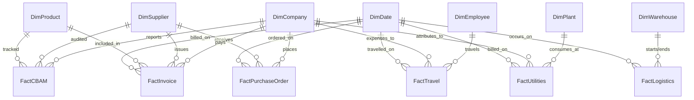

# Power BI Semantic Model (Star Schema)

This document describes the recommended star schema design and DAX measures for importing the CarbonLedger synthetic datasets into Power BI.

## Star Schema Architecture



---

## Model Components

### 1. Dimension Tables

- **`DimCompany`**: Mapped from `companies.csv`. Includes target sustainability parameters and Scope targets.
- **`DimSupplier`**: Mapped from `suppliers.csv`. Key filter columns: `Country`, `MaterialCategory`, `SupplierRating`, `EmissionScore`.
- **`DimProduct`**: Mapped from `products.csv` and `lifecycle.csv`. Contains product material types, cradle-to-grave emissions, selling price, and BOM cost structures.
- **`DimPlant`**: Mapped from `plants.csv`. Captures plant types, capacities, coordinates, and clean energy mixes.
- **`DimWarehouse`**: Mapped from `warehouses.csv`. Captures storage types and locations.
- **`DimEmployee`**: Mapped from `employees.csv`. Filters corporate divisions, hierarchy levels, and travel policies.
- **`DimDate`**: Generated calendar table with standard attributes (Year, Quarter, Month, Fiscal periods).

### 2. Fact Tables

- **`FactPurchaseOrder`**: Consolidated PO headers and items.
- **`FactInvoice`**: Procurement and accounts payable details.
- **`FactLogistics`**: IoT segments, vehicle fuel burns, travel distances, and segment speeds.
- **`FactUtilities`**: Consolidated monthly electricity, water, and waste logs.
- **`FactTravel`**: Employee business travels and hotel stays.
- **`FactCBAM`**: CBAM quarterly imported weights, direct/indirect emissions, and liability costs.

---

## Recommended DAX Measures

### 1. Total CO2e Emissions (metric tons)
```dax
Total CO2e Emissions (t) = 
DIVIDE(
    SUM(FactUtilities[CO2eEmission]) + 
    SUM(FactTravel[CO2eEmission]) + 
    SUM(FactLogistics[FuelConsumed]) * 2.75, -- Diesel EF representation
    1000
)
```

### 2. Scope 1 (Direct Fleet & Industrial Combustion)
```dax
Scope 1 Emissions (tCO2e) = 
DIVIDE(
    SUMX(
        FILTER(FactUtilities, Related(DimPlant[EnergySource]) <> "Grid Electricity"),
        FactUtilities[CO2eEmission]
    ) + SUM(FactLogistics[FuelConsumed]) * 2.75,
    1000
)
```

### 3. Scope 2 (Indirect Grid Electricity Purchase)
```dax
Scope 2 Emissions (tCO2e) = 
DIVIDE(
    SUMX(
        FILTER(FactUtilities, Related(DimPlant[EnergySource]) = "Grid Electricity"),
        FactUtilities[CO2eEmission]
    ),
    1000
)
```

### 4. Scope 3 (Value Chain - Procurement, Logistics, R&D Waste, Business Travel)
```dax
Scope 3 Emissions (tCO2e) = 
DIVIDE(
    SUM(FactTravel[CO2eEmission]) + 
    SUM(FactCBAM[EmbeddedEmission]), 
    1000
)
```

### 5. CBAM Tax Liability (USD)
```dax
CBAM Tax Liability = 
SUMX(
    FactCBAM,
    FactCBAM[EmbeddedEmission] * FactCBAM[CarbonPrice]
)
```
