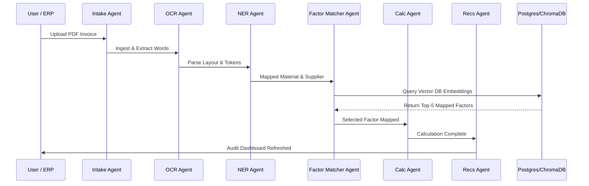
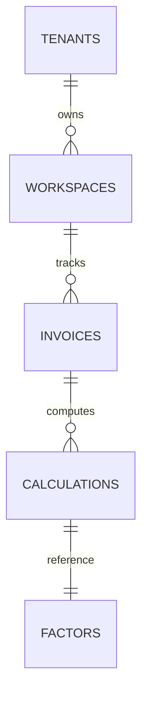
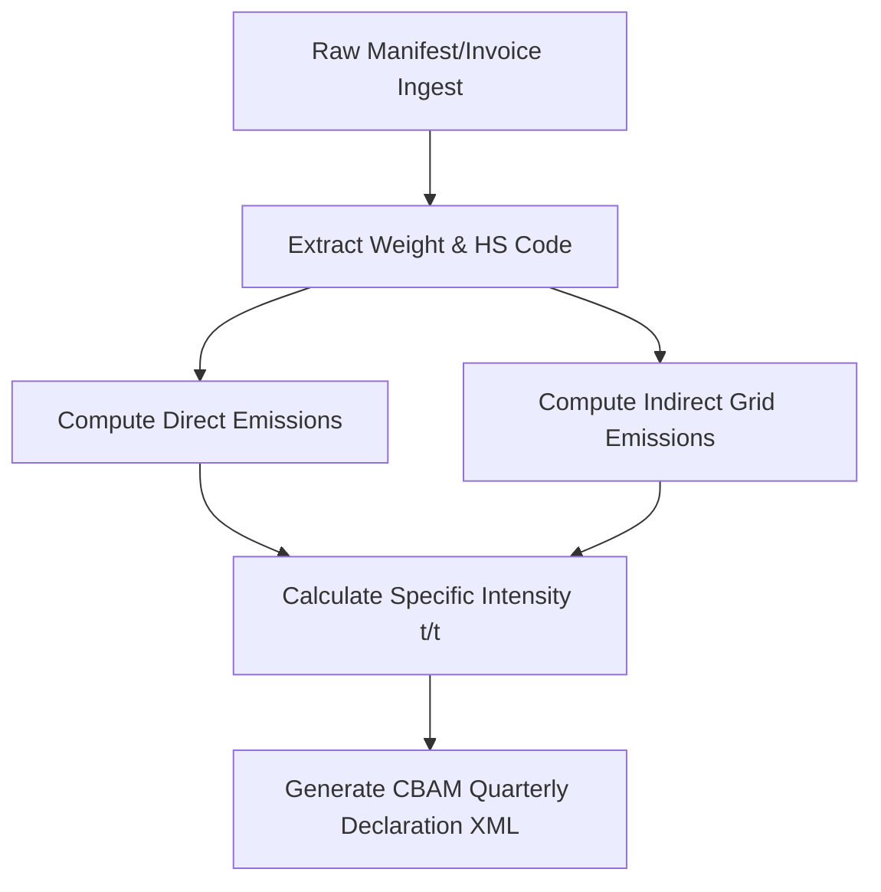

# CarbonLedger AI Auditor – Investor Pitch & Product Presentation Material

This document contains presentation outlines, scripts, brochures, and architectural visualizers to demonstrate CarbonLedger to investors, academic review boards, and prospective clients.

---

## 1. System Architecture & Workflows

### 1.1 Core Multi-Agent AI Pipeline
This sequence diagram shows the autonomous transfer of states and checkpoints across the 12 cooperative nodes:

### 1.2 Entity Relationship Diagram (ERD)
Exposes the database schema model containing multi-tenant credentials, invoice items, and calculation mappings:

### 1.3 CBAM Compliance Flow
Validation flow matching European Commission carbon border declarations:

---

## 2. Investor Pitch Slides Outline
- **Slide 1: Title & Purpose**: CarbonLedger AI Auditor - Autonomous Scope 1/2/3 Supply Chain ESG Auditor.
- **Slide 2: The Problem**: EU CBAM tariffs and corporate CSRD audits require granular, traceable carbon footprints; manual spreadsheets lead to audit failures.
- **Slide 3: The Solution**: Autonomous AI agent workflows replacing manual inputs with trainable deep learning classifiers, contrastive SentenceTransformers, and hybrid RAG.
- **Slide 4: Competitive Advantage**: Open-source model controls, sub-second latency, local edge deployment readiness, and Model Context Protocol (MCP) integrations.
- **Slide 5: Business Model**: Multi-tenant SaaS subscriptions (Free, Pro, Enterprise) powered by consumption-capped API keys and Stripe webhooks.

---

## 3. Screen Recording Demo Script
- **0:00 - 0:15 (Login)**: Presenter navigates to port 3000, enters demo credentials (`admin@carbonledger.ai`), and unlocks the main control screen.
- **0:15 - 0:45 (Dashboard & Audit)**: Showcases the 4 KPI boxes and the real-time agent execution stream logs.
- **0:45 - 1:15 (One-Click AI Demo)**: Presenter clicks "Run Complete AI Demo", highlighting the progress bar as the system runs OCR, classification, supplier risk estimation, and factors queries.
- **1:15 - 1:45 (CBAM Generation)**: Opens the *CBAM* tab to export XML and Excel formats.
- **1:45 - 2:00 (AI Copilot Chat)**: Type "Compare suppliers" in the Copilot chat, showing grounded citations from the RAG store.
